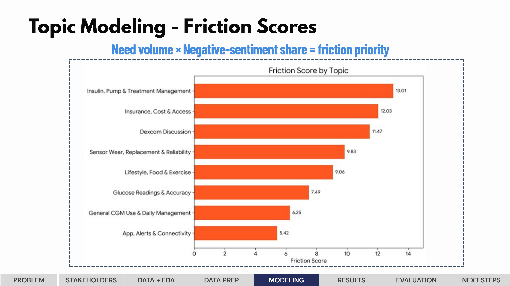
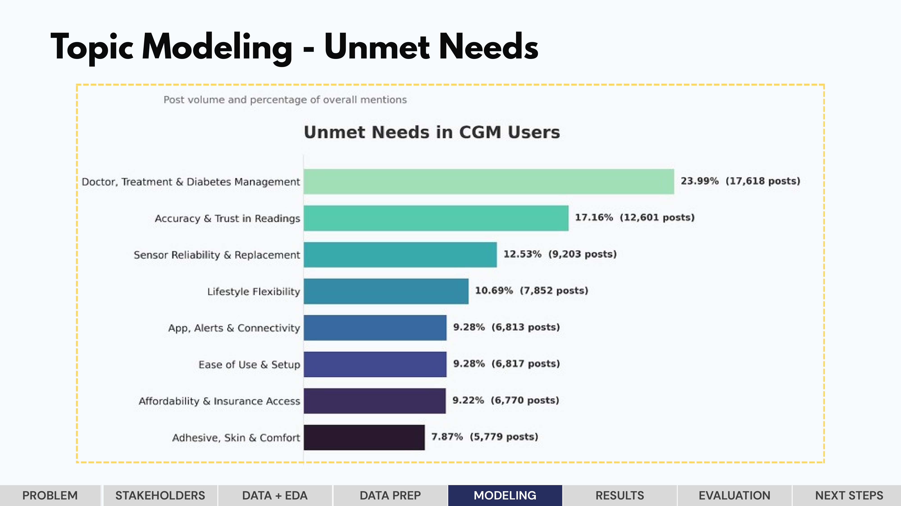
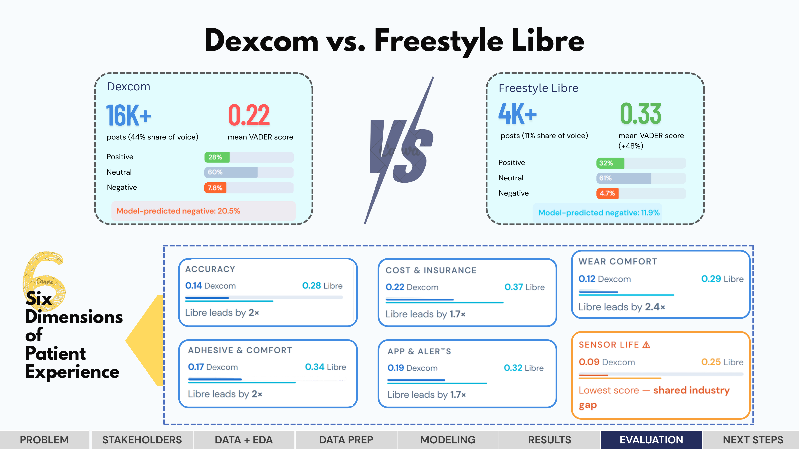
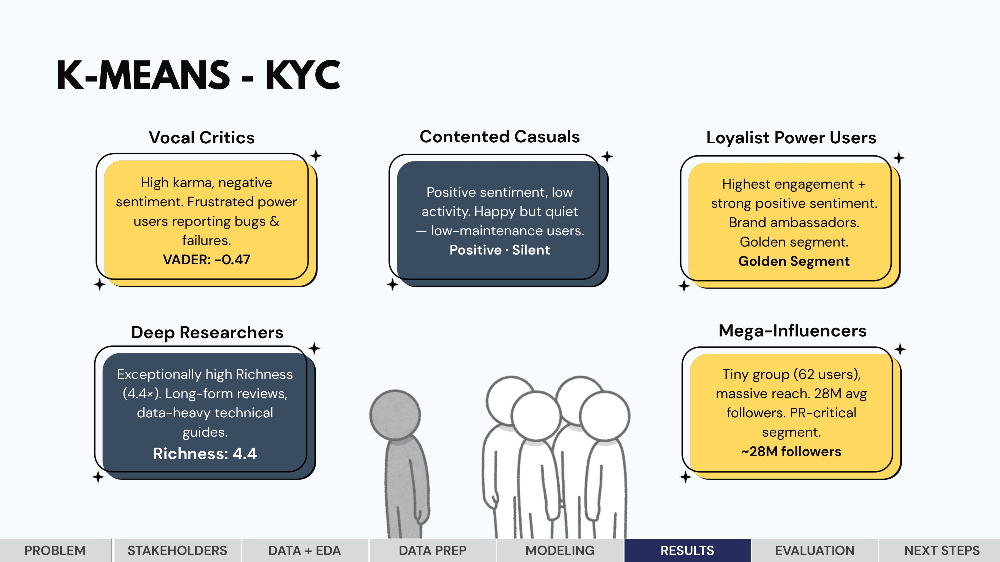
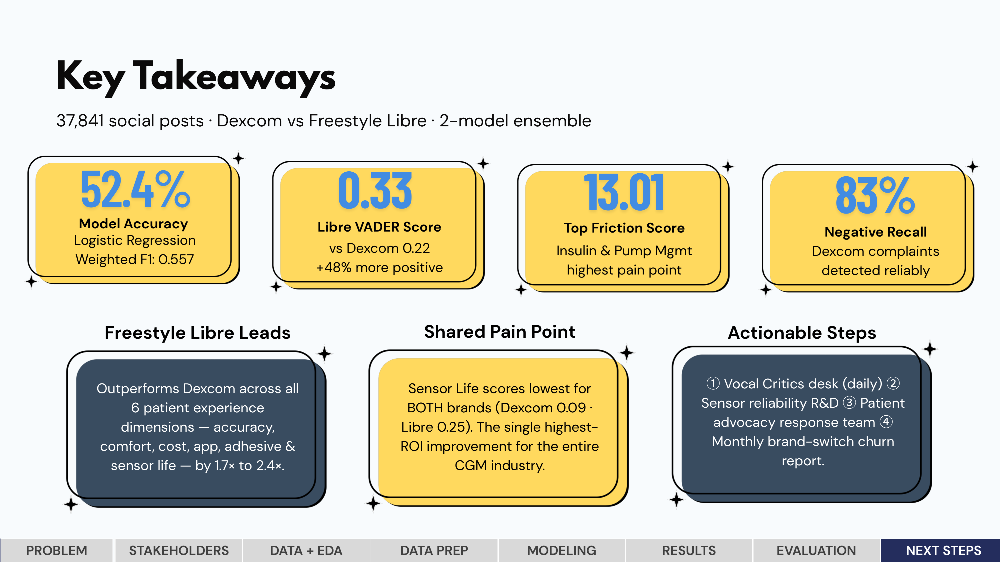

# Mining 37,000 Patient Voices to Guide Medical Device Strategy

An NLP and LLM analysis of social media discussion comparing two leading
continuous glucose monitors — Dexcom and Freestyle Libre.

**Tools:** Python · scikit-learn · NLTK/VADER · NMF & LDA Topic Modeling  
· K-Means · Multi-LLM prompting (GPT, Gemini, LLaMA)  
**Data:** 37,841 public social media posts (Reddit, forums, blogs, 
Twitter, Instagram)  
**Type:** End-to-end NLP pipeline (text processing → modeling → 
segmentation → LLM synthesis)

---

## The Business Problem

The continuous glucose monitor market is worth $15B+ and serves millions
of diabetes patients — yet manufacturers' understanding of real patient
pain points is largely surface-level, built on surveys and focus groups
rather than unsolicited patient voice.

**The question:** What do CGM users actually complain about, which brand
wins on which dimension, and where should a manufacturer focus to reduce
churn and improve outcomes?

---

## Key Findings

### 1. Friction Scoring — What's Actually Hurting Users

A custom **friction score** (need-volume × negative-sentiment share) 
ranked pain points by business impact:

| Rank | Topic | Friction Score |
|---|---|---|
| 1 | Insulin/Pump Management | 13.0 |
| 2 | Insurance & Cost | 11.4 |
| 3 | Sensor Adhesion | 9.7 |

### 2. Freestyle Libre Outperforms Dexcom — But Both Lose on One Thing

Aspect-based sentiment analysis across six experience dimensions:

| Dimension | Libre vs Dexcom Sentiment Gap |
|---|---|
| Accuracy | Libre +1.7× |
| Comfort | Libre +2.1× |
| Cost | Libre +2.4× |
| App Experience | Libre +1.9× |
| Adhesive | Libre +2.0× |
| Sensor Life | Lowest for **both brands** |

**Sensor life is the single highest-ROI improvement opportunity in the 
industry** — a shared gap neither brand has solved.

### 3. Complaint Detection at Scale

A Random Forest classifier achieved **83% recall on negative Dexcom 
posts** — reliable enough to power an automated complaint monitoring 
system without manual review of every post.

---

## Visualizations

### Friction Score by Topic

### Unmet Needs in CGM Users

### Dexcom vs Freestyle Libre — Six Dimensions

### User Segmentation (K-Means Personas)

### Key Takeaways

## Modeling & Segmentation

- Logistic Regression and Random Forest classifiers on TF-IDF features
- Stratified split, class-balanced, 5-fold cross-validated
- K-Means user segmentation into actionable personas including a 
  "Mega-Influencer" high-reach group and "Vocal Critics" segment
- Per-class performance reported (not hidden behind overall accuracy) — 
  64% neutral class imbalance documented as a known ceiling

---

## LLM-Driven Strategy Synthesis

Computed statistics were fed into structured prompts across three LLMs
to synthesize four concrete business actions:

1. **Daily complaint monitoring desk** using the trained classifier
2. **Sensor reliability R&D** as the top shared-industry fix
3. **Patient advocacy response team** for cost and insurance complaints
4. **Monthly brand-switch churn report** mining ~4,700 switching-language
   posts

---

## What This Demonstrates

- End-to-end NLP pipeline on noisy real-world social text at scale
- Original feature engineering (friction scoring) beyond standard 
  library outputs
- Honest evaluation — per-class metrics, documented class imbalance, 
  VADER audit of provider labels
- Connecting quantitative findings to concrete business decisions using 
  LLMs as synthesis tools

---

*Full methodology, notebooks, and figures available in this repository.*
